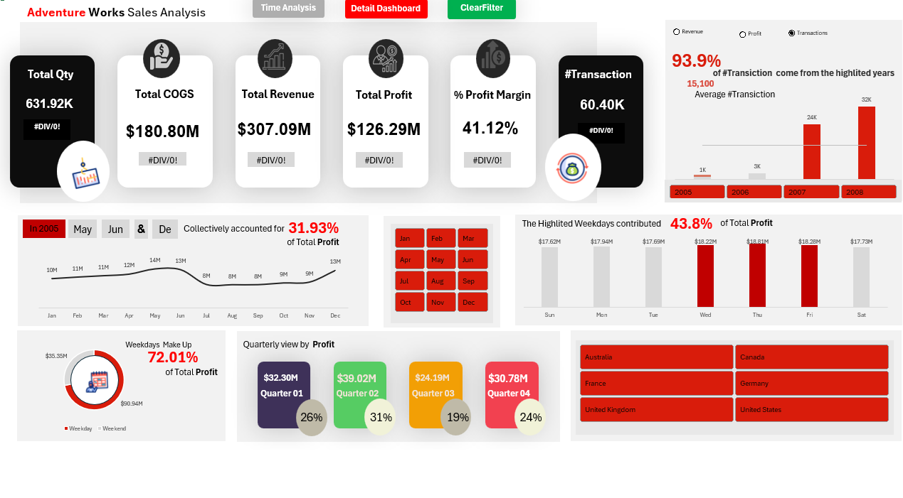
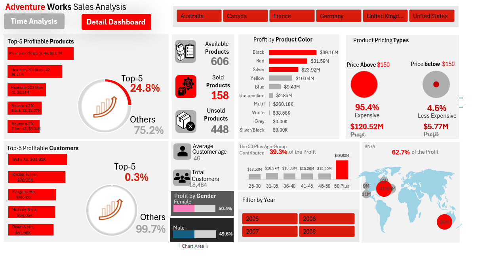

# Adventure Works Sales Analysis

## 📊 Project Overview

**Adventure Works Sales Analysis** is an interactive **Power BI** project designed to analyze sales performance, profitability, products, customers, and time-based trends.

The project transforms raw sales data into meaningful business insights through two interactive dashboards:

1. **Time Analysis Dashboard**
2. **Detail Dashboard**

The main goal is to help stakeholders understand **sales performance, profitability drivers, customer behavior, product performance, and business trends**.

---

## 🎯 Business Objectives

This project aims to answer key business questions such as:

* How much Revenue and Profit did the business generate?
* What is the overall Profit Margin?
* How do sales and profit change over time?
* Which quarters, months, and weekdays perform best?
* Which products generate the highest profit?
* Which customers contribute the most profit?
* Which product colors generate the highest profit?
* How does product pricing affect profitability?
* How does profit differ across customer age groups and genders?
* Which countries contribute most to the business performance?
* How are sold and unsold products distributed?

---

## 📌 Key Performance Indicators

The main KPIs presented in the dashboards include:

| KPI                |    Value |
| ------------------ | -------: |
| Total Quantity     |  631.92K |
| Total COGS         | $180.80M |
| Total Revenue      | $307.09M |
| Total Profit       | $126.29M |
| Profit Margin      |   41.12% |
| Total Transactions |   60.40K |

---

## 📈 Dashboard 1 — Time Analysis

The **Time Analysis Dashboard** focuses on understanding business performance across different time dimensions.

### Main Analysis

* Total Quantity
* Total COGS
* Total Revenue
* Total Profit
* Profit Margin
* Total Transactions
* Yearly Performance
* Monthly Performance
* Quarterly Profit Analysis
* Weekday vs. Weekend Performance
* Profit Contribution by Weekday
* Country Analysis

### Key Insights

* The dashboard shows an overall **Profit Margin of 41.12%**.
* Total Profit reached **$126.29M**.
* The analysis allows comparison between different years, months, quarters, and weekdays.
* Weekdays contributed **72.01% of total profit**, compared with 27.99% from weekends.
* The highlighted weekdays contributed **43.8% of total profit** in the selected analysis.
* Quarterly analysis shows the contribution of each quarter to total profit.

---

## 🔎 Dashboard 2 — Detail Dashboard

The **Detail Dashboard** provides a deeper analysis of products, customers, pricing, demographics, and geographic performance.

### Product Analysis

* Top 5 Most Profitable Products
* Profit by Product Color
* Available Products
* Sold Products
* Unsold Products
* Product Pricing Analysis
* Products Above and Below $150

### Customer Analysis

* Top 5 Most Profitable Customers
* Total Customers
* Average Customer Age
* Profit by Gender
* Profit by Age Group

### Geographic Analysis

The dashboard provides a geographic view of profit contribution across different countries, including:

* Australia
* Canada
* France
* Germany
* United Kingdom
* United States

### Key Insights

* There are **606 available products**.
* **158 products are sold**, while **448 products are unsold**.
* The Top 5 profitable products contribute **24.8%** of the selected profit.
* Products priced above $150 contribute **95.4% of profit** in the displayed analysis.
* Customers aged **50+** represent the largest contribution among the displayed age groups.
* Profit is distributed relatively evenly between genders, with approximately **50.4% Female** and **49.6% Male** in the displayed analysis.

---

## 🛠️ Tools & Technologies

* **Power BI**
* **Power Query**
* **DAX**
* **Data Visualization**
* **Data Cleaning & Transformation**
* **Business Intelligence**
* **Exploratory Data Analysis**

---

## 📊 Dashboard Features

The dashboards include interactive features such as:

* Year filters
* Country filters
* Month filters
* Interactive charts
* KPI cards
* Product analysis
* Customer analysis
* Geographic analysis
* Dynamic filtering
* Cross-filtering between visuals

---

## 💡 Business Value

This analysis can help decision-makers:

* Identify the most profitable products.
* Understand customer profitability.
* Monitor sales and profit trends.
* Identify high-performing periods.
* Evaluate pricing impact on profitability.
* Understand customer demographics.
* Compare geographic performance.
* Support data-driven sales and marketing decisions.

---

## 📷 Dashboard Preview

### Time Analysis Dashboard



### Detail Dashboard



---

## 📁 Project Structure

```text
Adventure-Works-Sales-Analysis/
│
├── Dashboard/
│   └── Adventure-Works-Sales-Analysis.pbix
│
├── Screenshots/
│   ├── Time-Analysis.png
│   └── Detail-Dashboard.png
│
└── README.md
```

---

## 👩‍💻 Author

### Hagar Hassan

**Data Analyst**

Interested in transforming data into meaningful insights and supporting business decisions through data analysis and visualization.

**Skills:**
SQL • Power BI • DAX • Power Query • Data Analysis • Data Visualization • Business Intelligence

---

## ⭐ Project Highlights

This project demonstrates practical experience in:

* Building interactive Power BI dashboards
* Creating business-focused KPIs
* Analyzing sales and profitability
* Performing customer and product analysis
* Creating time-based analysis
* Using DAX for analytical calculations
* Designing interactive and user-friendly reports
* Translating data into actionable business insights
